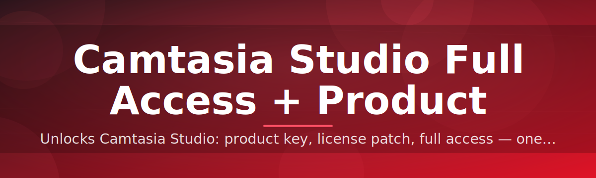

# 🔓 Camtasia Studio License Configurator

### ⭐ Star this repo if it helped you!

  

---

## 📑 Table of Contents

- [About](#-about)
- [Requirements](#-requirements)
- [Features](#-features)
- [How It Works](#-how-it-works)
- [Installation](#-installation)
- [FAQ](#-faq)
- [Community / Support](#-community--support)
- [License](#-license)
- [Disclaimer](#-disclaimer)
- [Download](#-download)

---

## 📋 Requirements

| Requirement | Details |
|---|---|
| **OS** | Windows 10 or Windows 11 (64-bit) |
| **Type** | Standalone `.exe` — no install needed |
| **Dependencies** | None — no Python, no pip, no build step |
| **Disk Space** | ~50 MB free |
| **Permissions** | Administrator rights recommended |
| **Internet** | Required only for download |

> [!IMPORTANT]
> This tool runs as a **single Windows executable**. There is no source build, no package manager, and no scripting required. Just download and run.

---

## 📖 About

**Camtasia Studio License Configurator** is a lightweight Windows utility that applies a full-access license patch to your local Camtasia Studio installation.

It's built for creators who want to unlock the complete feature set without juggling multiple manual license files or registry edits.

> [!NOTE]
> The tool works entirely offline once downloaded. No account, no sign-up, and no background telemetry.

---

## ✨ Features

- **One-click patching** — applies the license configuration in seconds
- **No dependencies** — pure standalone `.exe`, nothing else to install
- **Lightweight footprint** — small binary, minimal disk usage
- **Clean uninstall** — removes cleanly with no leftover files
- **Wide compatibility** — works across recent Camtasia Studio versions
- **Offline operation** — no network calls after download
- **Simple UI** — guided steps, no technical knowledge needed
- **Open source** — fully auditable codebase under MIT

---

## 🔄 How It Works

1. **Download** — grab the latest `.zip` from the Releases page above.
2. **Extract** — unzip the archive to any folder on your machine.
3. **Run the .exe** — launch the executable with administrator privileges.
4. **Apply & Restart** — follow the on-screen prompt, then restart Camtasia Studio to see full access enabled.

---

## 🛠 Installation

1. Click the **Download** button at the top of this README.
2. Extract the downloaded `.zip` file to a folder of your choice.
3. Right-click the `.exe` and select **Run as administrator**.
4. Follow the on-screen instructions to complete the configuration.

> [!WARNING]
> Always download releases from this repository's official **Releases** page only. Avoid third-party mirrors.

---

## ❓ FAQ

**Does this require Python or any programming knowledge?**
No. The tool is a compiled standalone `.exe` — no scripts, no pip, no coding required.

**Which Windows versions are supported?**
Windows 10 and Windows 11, both 64-bit.

**Do I need to disable my antivirus?**
Some antivirus tools may flag license patchers heuristically. Review the source code or add an exception if you trust the build.

> [!TIP]
> If the `.exe` doesn't launch, try running it as administrator or check that your extraction folder path doesn't contain special characters.

---

## 💬 Community / Support

This project welcomes contributors of all experience levels.

- **Found a bug?** Open an [Issue](../../issues) with reproduction steps.
- **Have an idea?** Start a [Discussion](../../discussions).
- **New to open source?** Look for issues labeled `good first issue` — they're scoped for newcomers.
- **Want to contribute code?** Fork the repo, make your changes, and open a Pull Request.

Every contribution, big or small, is appreciated. ⭐ Starring the repo helps others discover it too.

---

## 📄 License

Released under the **MIT License**, 2026.

You are free to use, modify, and distribute this software in accordance with the license terms. See the `LICENSE` file for full details.

---

## ⚠️ Disclaimer

> [!CAUTION]
> This tool is provided for **educational and personal use purposes only**. Modifying licensed software may violate the terms of service of the original vendor. Use at your own risk. The maintainers of this repository are not responsible for any consequences resulting from its use, including but not limited to software instability, data loss, or violation of third-party license agreements.

---

## ⬇️ Download

  

